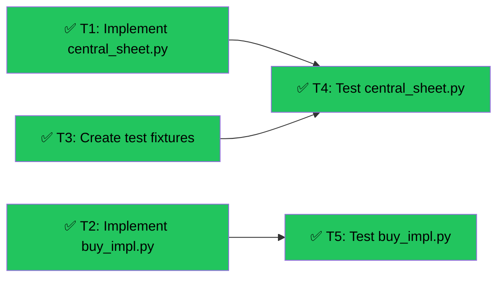

# Slice 3 - Central Sheet + Buy Impl
Branch: main | Level: 2 | Type: implement | Status: complete
Started: 2026-03-05T00:00:00Z

## DAG


## Tree
```
✅ T1: Implement central_sheet.py [routine]
└──→ ✅ T4: Test central_sheet.py [routine]
✅ T2: Implement buy_impl.py [routine]
└──→ ✅ T5: Test buy_impl.py [routine]
✅ T3: Create test fixtures [routine]
└──→ ✅ T4: Test central_sheet.py [routine]
```

## Tasks

### T1: Implement central_sheet.py [implement] [routine]
- Scope: src/central_sheet.py
- Verify: `python -c "from src.central_sheet import CentralSheet; s = CentralSheet(':memory:'); s.write_agent('test', 'Test', 'http://x', 'plan1'); print(s.read_agents())" 2>&1 | tail -5`
- Needs: none
- Status: done ✅
- Summary: Thread-safe SQLite wrapper with WAL mode, 4 tables + 1 view, all 11 CRUD methods
- Files: src/central_sheet.py

### T2: Implement buy_impl.py [implement] [routine]
- Scope: src/buy_impl.py
- Verify: `python -c "from src.buy_impl import purchase_data_impl, check_balance_impl, discover_pricing_impl, build_token_options; print('All imports successful')" 2>&1 | tail -5`
- Needs: none
- Status: done ✅
- Summary: 4 x402 payment functions with HTTP 402 handling, card delegation support
- Files: src/buy_impl.py

### T3: Create test fixtures [implement] [routine]
- Scope: tests/fixtures/sample_agents.json
- Verify: `python -c "import json; d=json.load(open('tests/fixtures/sample_agents.json')); assert len(d)==3; print('Fixture valid')" 2>&1 | tail -5`
- Needs: none
- Status: done ✅
- Summary: 3 fake agent objects with all required fields for downstream tests
- Files: tests/fixtures/sample_agents.json

### T4: Test central_sheet.py [test] [routine]
- Scope: tests/test_central_sheet.py
- Verify: `pytest tests/test_central_sheet.py -v 2>&1 | tail -10`
- Needs: T1, T3
- Status: done ✅
- Summary: 25 comprehensive tests covering all CRUD, JSON serialization, portfolio view, P&L
- Files: tests/test_central_sheet.py

### T5: Test buy_impl.py [test] [routine]
- Scope: tests/test_buy_impl.py
- Verify: `pytest tests/test_buy_impl.py -v 2>&1 | tail -10`
- Needs: T2
- Status: done ✅
- Summary: 13 mocked tests for all 4 functions, HTTP 402 handling, error cases
- Files: tests/test_buy_impl.py

## Summary
Completed: 5/5 | Duration: ~5 minutes
Files changed:
- src/central_sheet.py (full implementation)
- src/buy_impl.py (full implementation)
- tests/fixtures/sample_agents.json (new)
- tests/test_central_sheet.py (25 tests)
- tests/test_buy_impl.py (13 tests)

All verifications: passed
- ✅ CentralSheet creates tables, CRUD works, portfolio view aggregates correctly
- ✅ buy_impl all imports successful
- ✅ pytest tests/test_central_sheet.py — 25 passed
- ✅ pytest tests/test_buy_impl.py — 13 passed
