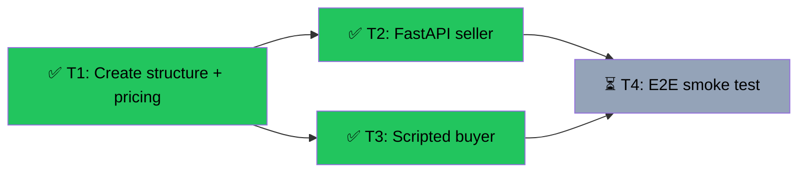

# Slice 2 — Seller + Buyer Smoke Test
Branch: main | Level: 2 | Type: implement | Status: in_progress
Started: 2026-03-05T00:00:00Z

## DAG


## Tree
```
✅ T1: Create structure + pricing [routine]
├──→ ✅ T2: FastAPI seller [careful]
│    └──→ ⏳ T4: E2E smoke test [routine]
└──→ ✅ T3: Scripted buyer [careful]
     └──→ ⏳ T4: E2E smoke test [routine]
```

## Tasks

### T1: Create smoke test structure + pricing [implement] [routine]
- Scope: src/smoke/__init__.py, src/smoke/pricing.py
- Verify: `python -c "from src.smoke.pricing import PRICING; print(PRICING)"`
- Needs: none
- Status: done ✅
- Summary: Created smoke module with pricing config
- Files: src/smoke/__init__.py, src/smoke/pricing.py

### T2: Implement FastAPI seller with x402 [implement] [careful]
- Scope: src/smoke/seller.py
- Verify: `poetry run smoke-seller & sleep 3 && curl localhost:3000/pricing && kill %1`
- Needs: T1
- Status: done ✅
- Summary: Created FastAPI seller with manual verify+settle pattern, auto-registration
- Files: src/smoke/seller.py

### T3: Implement scripted buyer [implement] [careful]
- Scope: src/smoke/buyer.py
- Verify: `python -c "from src.smoke.buyer import main; print('imports ok')"`
- Needs: T1
- Status: done ✅
- Summary: Created scripted buyer with full x402 flow (discover → balance → purchase)
- Files: src/smoke/buyer.py

### T4: End-to-end smoke test [test] [routine]
- Scope: tests/
- Verify: `poetry run smoke-seller & sleep 3 && poetry run smoke-buyer; kill %1`
- Needs: T2, T3
- Status: pending ⏳
