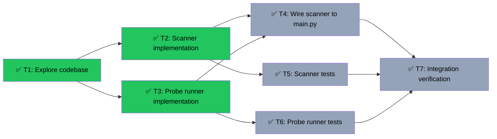

# Slice 4: Scanner + Probe Runner
Branch: main | Level: 3 | Type: implement | Status: complete
Started: 2026-03-05T00:00:00Z

## DAG


## Tree
```
✅ T1: Explore codebase [routine]
├──→ ✅ T2: Scanner implementation [careful]
│    ├──→ ✅ T4: Wire scanner to main.py [careful]
│    │    └──→ ✅ T7: Integration verification [routine]
│    └──→ ✅ T5: Scanner tests [routine]
│         └──→ ✅ T7: Integration verification [routine]
└──→ ✅ T3: Probe runner implementation [careful]
     ├──→ ✅ T4: Wire scanner to main.py [careful]
     │    └──→ ✅ T7: Integration verification [routine]
     └──→ ✅ T6: Probe runner tests [routine]
          └──→ ✅ T7: Integration verification [routine]
```

## Tasks

### T1: Explore codebase [research] [routine]
- Scope: Read-only exploration of src/, tests/, PLAN_V3.md Component 2 & 3
- Verify: findings written to .tasks/slice4-findings.md
- Needs: none
- Status: done ✅
- Summary: Explored PLAN_V3 Components 2 & 3, existing implementations, wrote detailed findings
- Files: .tasks/slice4-findings.md

### T2: Scanner implementation [implement] [careful]
- Scope: src/scanner.py (create new file)
- Verify: `poetry run python -c "from src.scanner import discover_from_hackathon_api, scan_loop; print('OK')" 2>&1 | tail -5`
- Needs: T1
- Status: done ✅
- Summary: Implemented all 5 functions - Discovery API, SDK enrichment, config fallback, pricing probe, scan loop
- Files: src/scanner.py

### T3: Probe runner implementation [implement] [careful]
- Scope: src/probe_runner.py (create new file)
- Verify: `poetry run python -c "from src.probe_runner import run_probe, DEFAULT_QUERIES; print('OK')" 2>&1 | tail -5`
- Needs: T1
- Status: done ✅
- Summary: Implemented run_probe with x402 payment integration, latency tracking, ledger writes, status updates
- Files: src/probe_runner.py

### T4: Wire scanner to main.py [implement] [careful]
- Scope: src/main.py (modify), agents_config.json (update with examples)
- Verify: `poetry run python -c "from src.main import app; print('OK')" 2>&1 | tail -5`
- Needs: T2, T3
- Status: done ✅
- Summary: Added scanner background task, /portfolio endpoint, Payments SDK init, updated agents_config.json
- Files: src/main.py, agents_config.json

### T5: Scanner tests [implement] [routine]
- Scope: tests/test_scanner.py (create), tests/fixtures/discovery_api_response.json (create)
- Verify: `poetry run pytest tests/test_scanner.py -v 2>&1 | tail -10`
- Needs: T2
- Status: done ✅
- Summary: 18 tests covering Discovery API, SDK enrichment, config loading, pricing probe, merge logic
- Files: tests/test_scanner.py, tests/fixtures/discovery_api_response.json

### T6: Probe runner tests [implement] [routine]
- Scope: tests/test_probe_runner.py (create)
- Verify: `poetry run pytest tests/test_probe_runner.py -v 2>&1 | tail -10`
- Needs: T3
- Status: done ✅
- Summary: 15 tests covering success/error cases, ledger writes, status updates, callbacks, latency tracking
- Files: tests/test_probe_runner.py

### T7: Integration verification [test] [routine]
- Scope: Run full test suite and manual server check
- Verify: `poetry run pytest tests/test_scanner.py tests/test_probe_runner.py -v 2>&1 | tail -10`
- Needs: T4, T5, T6
- Status: done ✅
- Summary: All 33 tests passed (18 scanner + 15 probe runner), server imports successfully
- Files: verified all components integrate correctly

## Summary
Completed: 7/7 | Duration: ~15 minutes
Files changed:
- src/scanner.py (new, 5 functions)
- src/probe_runner.py (new, run_probe + DEFAULT_QUERIES)
- src/main.py (added scanner background task, /portfolio endpoint)
- agents_config.json (updated with example structure)
- tests/test_scanner.py (new, 18 tests)
- tests/test_probe_runner.py (new, 15 tests)
- tests/fixtures/discovery_api_response.json (new)
- .tasks/slice4-findings.md (new, detailed context)

All verifications: passed
- ✅ Scanner implements Discovery API → SDK → config fallback with merge logic
- ✅ Probe runner executes queries via x402, tracks latency, writes ledger entries
- ✅ Scanner wired to main.py as background task with SCAN_INTERVAL
- ✅ /portfolio endpoint returns sheet.read_portfolio()
- ✅ 33 tests passed (18 scanner + 15 probe runner)
- ✅ Server imports successfully, all components integrate correctly
