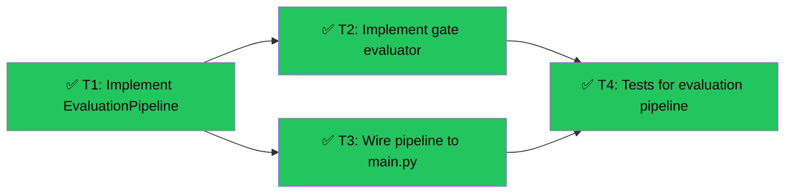

# Slice 5: Evaluation Pipeline
Branch: main | Level: 2 | Type: implement | Status: complete
Started: 2026-03-05T00:00:00Z

## DAG


## Tree
```
✅ T1: Implement EvaluationPipeline [routine]
├──→ ✅ T2: Implement gate evaluator [routine]
│    └──→ ✅ T4: Tests for evaluation pipeline [routine]
└──→ ✅ T3: Wire pipeline to main.py [careful]
     └──→ ✅ T4: Tests for evaluation pipeline [routine]
```

## Tasks

### T1: Implement EvaluationPipeline [implement] [routine]
- Scope: src/evaluation.py
- Verify: `poetry run python -c "from src.evaluation import EvaluationPipeline, pipeline; print('OK')" 2>&1 | tail -5`
- Needs: none
- Status: done ✅
- Summary: Replaced stub with full implementation - register/unregister evaluators, concurrent dispatch via asyncio.gather, error isolation
- Files: src/evaluation.py

### T2: Implement gate evaluator [implement] [routine]
- Scope: src/evaluators/gate.py (create)
- Verify: `poetry run python -c "from src.evaluators.gate import gate_evaluator; print('OK')" 2>&1 | tail -5`
- Needs: T1
- Status: done ✅
- Summary: Binary pass/fail evaluator - >50% error rate marks agent as dead, no LLM needed
- Files: src/evaluators/gate.py

### T3: Wire pipeline to main.py [implement] [careful]
- Scope: src/main.py, src/scanner.py
- Verify: `poetry run python -c "from src.main import app; print('OK')" 2>&1 | tail -5`
- Needs: T1, T2
- Status: done ✅
- Summary: Registered gate evaluator in startup, added eval_callback to scanner, wired callback through probe_runner
- Files: src/main.py, src/scanner.py

### T4: Tests for evaluation pipeline [implement] [routine]
- Scope: tests/test_evaluation.py (create)
- Verify: `pytest tests/test_evaluation.py -v 2>&1 | tail -10`
- Needs: T1, T2, T3
- Status: done ✅
- Summary: 11 tests covering pipeline registration, concurrent dispatch, error isolation, gate logic (100% success, 50/50, 100% fail)
- Files: tests/test_evaluation.py

## Summary
Completed: 4/4 | Duration: ~5 minutes
Files changed:
- src/evaluation.py (full implementation replacing stub)
- src/evaluators/gate.py (new, binary pass/fail evaluator)
- src/main.py (registered gate evaluator, added eval_callback)
- src/scanner.py (added eval_callback parameter, pass to probe_callback)
- tests/test_evaluation.py (new, 11 tests)

All verifications: passed
- ✅ EvaluationPipeline implements register/unregister/run with concurrent dispatch
- ✅ Gate evaluator marks agents with >50% error rate as dead
- ✅ Pipeline wired to main.py startup, eval_callback flows through scanner → probe_runner
- ✅ 11 tests passed covering all evaluation logic and gate scenarios
